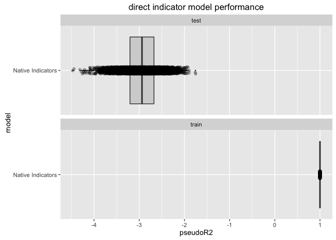

``` r
library('dplyr')
```

    ## 
    ## Attaching package: 'dplyr'

    ## The following objects are masked from 'package:stats':
    ## 
    ##     filter, lag

    ## The following objects are masked from 'package:base':
    ## 
    ##     intersect, setdiff, setequal, union

``` r
library('tidyr')
library('sigr') # https://github.com/WinVector/sigr
library('ggplot2')
library('vtreat')
source('fns.R')

set.seed(236526)

cl <- parallel::makeCluster(parallel::detectCores())
parallel::clusterExport(cl=cl, setdiff(ls(),'cl'),
              envir=environment())
for(lib in c('dplyr', 'tidyr', 'vtreat' )) {
  mkfn <- function(lib) {
    force(lib)
    function() {
      library(lib,character.only = TRUE)
    }
  }
  fn <- mkfn(lib)
  parallel::clusterCall(cl, fn )
}
```

``` r
cacheFile <- 'fitDirect.RDS'
if(!file.exists(cacheFile)) {
  mkRunExpmt <- function() {
    function(runnum) {
      generator = defineGenerator(5,20,0.75,0.3)
      ndup = 0
      dTrain <- generateData(generator,ndup,500)
      dTest <- generateData(generator,ndup,10000)
      # often errors-out on due to novel levels (if it happens, a rare but possible event)
      vars <- setdiff(colnames(dTrain),'y')
      novelRows <- sort(unique(unlist(lapply(vars,
                                             function(vi) {
                                               which(!(dTest[[vi]] %in% unique(dTrain[[vi]])))
                                             }))))
      dTestSub <- dTest
      resi <- runIndicators(dTrain,dTest[setdiff(seq_len(nrow(dTest)),novelRows),,drop=FALSE])
      resi$novelRows <- length(novelRows)
      resi$ndup <- ndup
      resi$runnum <- runnum
      resi
    }
  }
  runner <- mkRunExpmt()
  exmpts <- parallel::parLapplyLB(cl,seq_len(5000),runner)
  fitRes <- dplyr::bind_rows(exmpts)
  saveRDS(fitRes,file=cacheFile)
} else {
  fitRes <- readRDS(file=cacheFile)
}
```

``` r
d <- readRDS('fitDirect.RDS')
d$ndup <- factor(d$ndup,levels = rev(sort(unique(d$ndup))))
print(mean(d$novelRows))
```

    ## [1] 0.1

``` r
print(mean(d$novelRows>0))
```

    ## [1] 4e-04

``` r
print(WVPlots::ScatterBoxPlotH(d,'pseudoR2','ndup','direct indicator model performance') +
         facet_wrap(~data,ncol=1))
```



``` r
parallel::stopCluster(cl)
```
